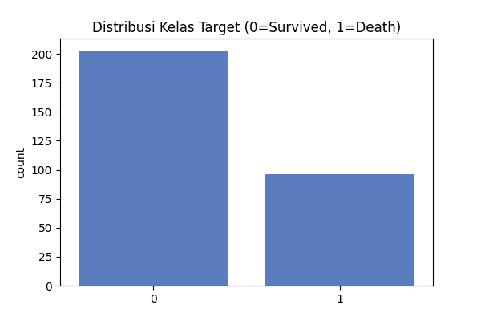
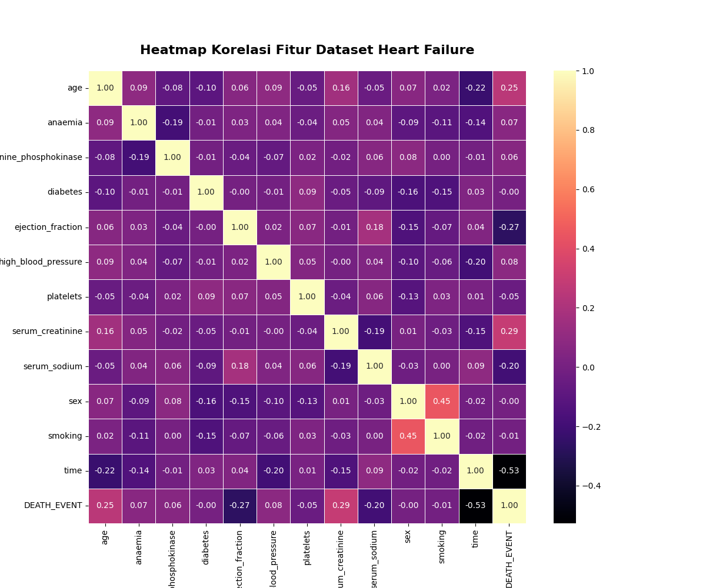
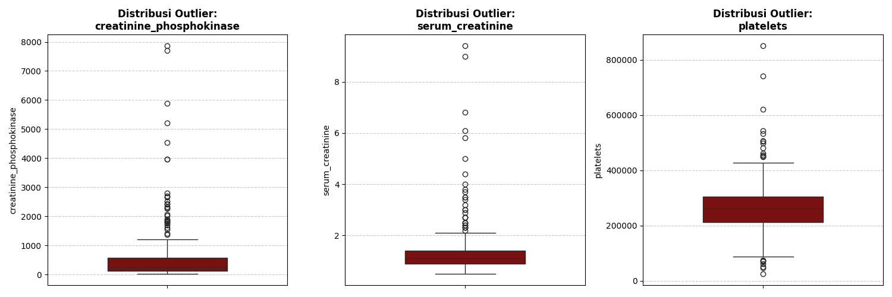
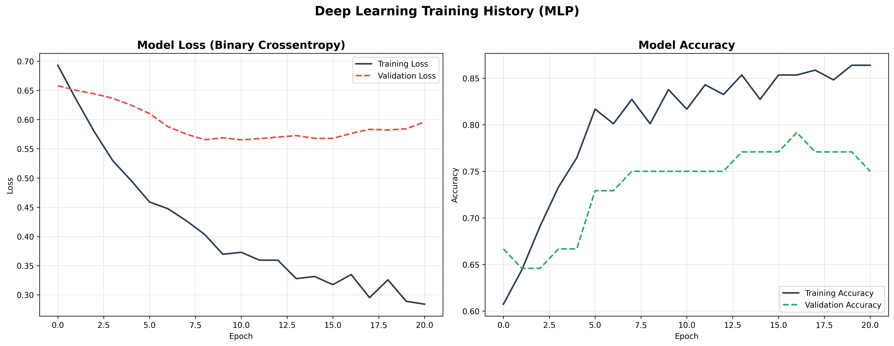
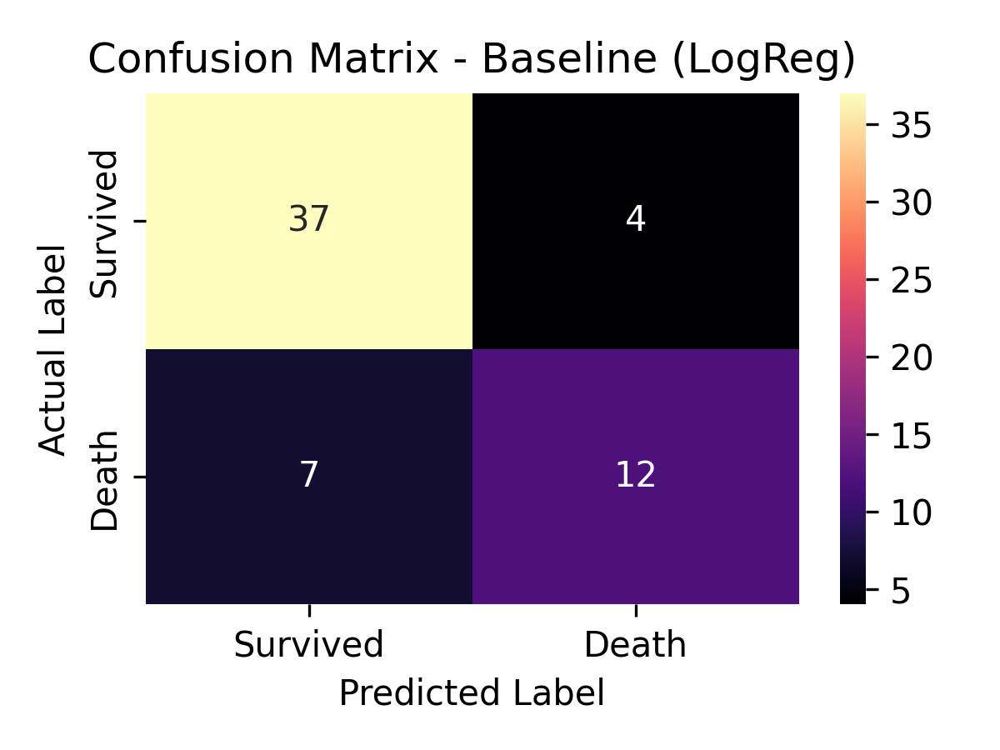
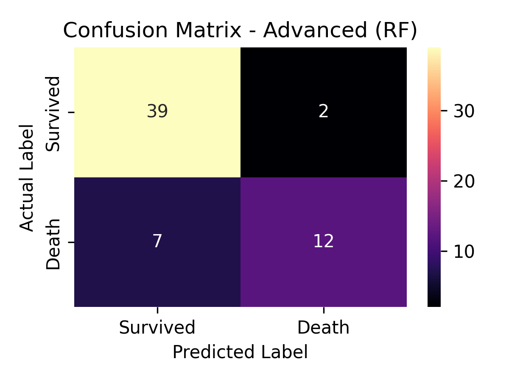
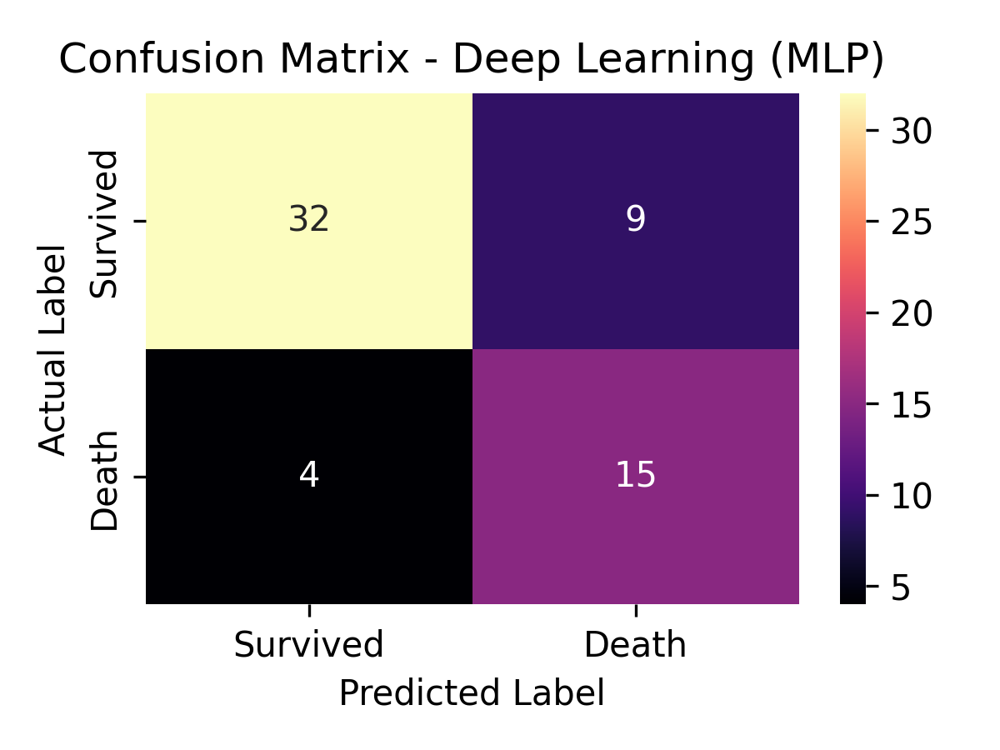
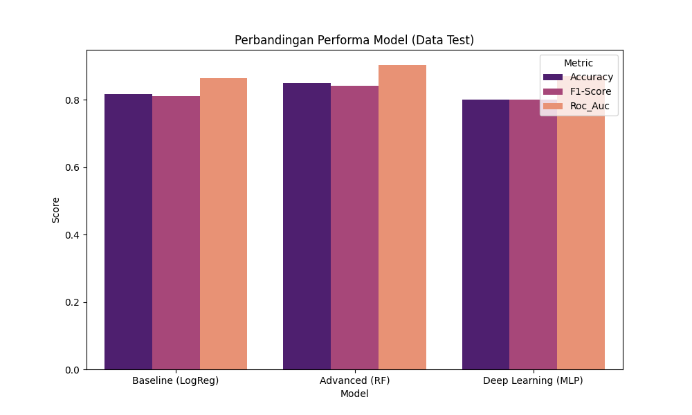

## INFORMASI PROYEK

**Judul Proyek:**  
[Klasifikasi Mortalitas (Kematian) Pasien Gagal Jantung Menggunakan Algoritma Machine Learning dan Deep Learning]

**Nama Mahasiswa:** [Alif Rahmathul]  
**NIM:** [234311030]  
**Program Studi:** [Teknologi Rekayasa Perangkat Lunak]  
**Mata Kuliah:** [Data Science]  
**Dosen Pengampu:** [Gus Nanang Syaifuddin,S.Kom.,M.Kom.]  
**Tahun Akademik:** [2025/5]
**Link GitHub Repository:** https://github.com/aliframework/deeplearning
**Link Video Pembahasan:** [URL Repository]

---

## 1. LEARNING OUTCOMES
Pada proyek ini, mahasiswa diharapkan dapat:
1. Memahami konteks masalah dan merumuskan problem statement secara jelas
2. Melakukan analisis dan eksplorasi data (EDA) secara komprehensif (**OPSIONAL**)
3. Melakukan data preparation yang sesuai dengan karakteristik dataset
4. Mengembangkan tiga model machine learning yang terdiri dari (**WAJIB**):
   - Model baseline
   - Model machine learning / advanced
   - Model deep learning (**WAJIB**)
5. Menggunakan metrik evaluasi yang relevan dengan jenis tugas ML
6. Melaporkan hasil eksperimen secara ilmiah dan sistematis
7. Mengunggah seluruh kode proyek ke GitHub (**WAJIB**)
8. Menerapkan prinsip software engineering dalam pengembangan proyek

---

## 2. PROJECT OVERVIEW

### 2.1 Latar Belakang
Mengapa Proyek Ini Penting?
Proyek ini penting karena Gagal Jantung (Heart Failure/HF) adalah masalah kesehatan global dengan tingkat mortalitas yang tinggi. Kemampuan untuk secara akurat dan cepat mengidentifikasi pasien berisiko tinggi adalah krusial untuk intervensi medis yang tepat waktu dan terpersonalisasi. Model prediksi berbasis data dapat meningkatkan objektivitas dalam penilaian risiko dibandingkan metode tradisional.

Permasalahan Umum pada Domain Terkait (Kesehatan)
Permasalahan umum terletak pada kompleksitas diagnosis dan prognosis HF. Penilaian risiko secara tradisional (berdasarkan skor klinis atau rule of thumb) seringkali memiliki keterbatasan karena interaksi antar variabel klinis (seperti usia, fraksi ejeksi, dan kadar serum) bersifat rumit, non-linear, dan sulit ditangkap oleh model statistik sederhana.

Manfaat Proyek untuk Pengguna, Bisnis, atau Penelitian

* Pengguna (Tenaga Medis): Menyediakan Sistem Pendukung Keputusan Klinis (Clinical Decision Support System—CDSS) yang objektif untuk membantu mengkategorikan pasien berisiko tinggi.

* Penelitian: Menunjukkan efektivitas komparatif antara model Machine Learning dan Deep Learning dalam mengekstrak pola kompleks dari data klinis, menjadi dasar untuk studi prognosis penyakit kardiovaskular lanjutan.

* Manfaat Utama: Berpotensi meningkatkan kualitas perawatan pasien dan survival rate dengan memungkinkan intervensi medis yang lebih dini dan terfokus.

Studi Literatur atau Referensi Ilmiah
Referensi yang digunakan dalam proyek ini adalah:

1. Chicco, D., & Jurman, G. (2020). Machine learning can predict survival of patients with heart failure from serum creatinine and ejection fraction only. BMC Medical Informatics and Decision Making, 20(1).

2. Al-Hussainy, G. P. M. F. C. A., Al-Musawi, A. H., & Al-Tameemi, A. R. R. (2022). Deep learning-based predictive models for cardiovascular disease: a systematic review. Expert Systems with Applications, 208, 118182.

**Contoh referensi (berformat APA/IEEE):**
> Goodfellow, I., Bengio, Y., & Courville, A. (2016). *Deep Learning*. MIT Press.

| Aspek         | Deskripsi                                                                 |
|:--------------|:--------------------------------------------------------------------------|
| Domain        | Kesehatan (Kardiologi)                                                    |
| Kondisi       | Gagal Jantung (Heart Failure/HF), penyebab morbiditas dan mortalitas signifikan |
| Tujuan Medis  | Menentukan risiko mortalitas pasien dalam jangka waktu tertentu (prognosis) |
| Data          | Data klinis pasien selama follow-up: variabel demografi, kebiasaan, dan tes laboratorium (contoh: creatinine_serum, ejection_fraction, platelets) |
| Target Output | Variabel biner DEATH_EVENT (0: Bertahan Hidup, 1: Meninggal)              |

### Latar Belakang Penerapan Data Science

Secara historis, dokter mengandalkan skor risiko klinis atau penilaian subjektif. Metode ini seringkali gagal menangkap interaksi kompleks antar variabel. Contohnya, hubungan antara kadar $creatinine\_serum$ yang tinggi dan $ejection\_fraction$ yang rendah mungkin memiliki efek non-linear terhadap risiko kematian yang sulit diukur oleh model statistik linear sederhana.

#### Justifikasi Machine Learning (ML/DL)
- **Identifikasi Pola Kompleks**: ML/DL unggul dalam menemukan pola non-linear dan interaksi kompleks antar fitur (variabel klinis) yang tersembunyi.
- **Objektivitas**: Model ML menawarkan alat bantu keputusan yang objektif, mengurangi variasi dalam penilaian risiko antar dokter.
- **Peningkatan Akurasi**: Penelitian (seperti yang dilakukan oleh Chicco & Jurman, 2020) menunjukkan bahwa model ML dapat melebihi performa skor klinis tradisional, bahkan dengan jumlah fitur yang terbatas.

## 3. BUSINESS UNDERSTANDING / PROBLEM UNDERSTANDING
### 3.1 Problem Statements
Berdasarkan latar belakang dan karakteristik domain kesehatan kardiovaskular, permasalahan yang diangkat dalam proyek ini adalah sebagai berikut:

1. Tingginya tingkat mortalitas pasien gagal jantung memerlukan sistem prediksi risiko yang akurat dan objektif untuk membantu tenaga medis dalam pengambilan keputusan klinis.

2. Pendekatan tradisional berbasis skor klinis sering kali tidak mampu menangkap hubungan non-linear dan interaksi kompleks antar variabel klinis seperti usia, fraksi ejeksi, dan kadar kreatinin serum.

3. Dataset klinis bersifat tabular dan cenderung imbalanced, sehingga diperlukan teknik preprocessing dan evaluasi model yang tepat agar prediksi tidak bias terhadap kelas mayoritas.

4. Perlu dilakukan perbandingan performa antara model baseline, machine learning lanjutan, dan deep learning untuk menentukan pendekatan terbaik dalam memprediksi mortalitas pasien gagal jantung.

### 3.2 Goals
**Tujuan dari proyek data science ini adalah:**

1. Membangun model klasifikasi untuk memprediksi mortalitas pasien gagal jantung dengan target akurasi minimal ≥ 80%.

2. Membandingkan performa tiga pendekatan model, yaitu baseline model, advanced machine learning model, dan deep learning model.

3. Menentukan model terbaik berdasarkan metrik evaluasi yang relevan untuk data medis (accuracy, precision, recall, F1-score, dan ROC-AUC).

4. Menghasilkan pipeline analisis yang reproducible, terdokumentasi dengan baik, dan dapat digunakan sebagai dasar sistem pendukung keputusan klinis.

### 3.3 Solution Approach

Mahasiswa **WAJIB** menggunakan minimal **tiga model** dengan komposisi sebagai berikut:
#### **Model 1 – Baseline Model**
Model sederhana sebagai pembanding dasar.
**Model yang dipilih: Logistic Regression**

Alasan Pemilihan:

Logistic Regression merupakan model klasifikasi linier yang sederhana dan umum digunakan dalam bidang medis.

Model ini mudah diinterpretasikan dan sering dijadikan baseline dalam penelitian prediksi klinis.

Memberikan pembanding dasar sebelum menggunakan model yang lebih kompleks.

Logistic Regression memodelkan probabilitas kejadian kematian (DEATH_EVENT = 1) berdasarkan kombinasi linier dari fitur-fitur klinis yang tersedia.

#### **Model 2 – Advanced / ML Model**
Model machine learning yang lebih kompleks.
**Model yang dipilih: Random Forest Classifier**

Alasan Pemilihan:

* Random Forest mampu menangkap hubungan non-linear antar fitur.

* Lebih robust terhadap noise dan outliers dibanding model linier.

* Menyediakan informasi feature importance yang berguna untuk interpretasi medis.

Random Forest merupakan ensemble dari beberapa decision tree yang bekerja secara voting, sehingga meningkatkan stabilitas dan akurasi prediksi.

#### **Model 3 – Deep Learning Model (WAJIB)**
Model deep learning yang sesuai dengan jenis data.
**Model yang dipilih: Multilayer Perceptron (MLP)**

Jenis Deep Learning:
Multilayer Perceptron (MLP) – untuk data tabular

Alasan Pemilihan:

- Dataset berbentuk data tabular numerik, sehingga MLP merupakan arsitektur deep learning yang paling sesuai.

- MLP mampu mempelajari representasi non-linear yang kompleks dari data klinis.

- Digunakan untuk membandingkan efektivitas deep learning terhadap model ML konvensional pada dataset berukuran kecil-menengah.

---

## 4. DATA UNDERSTANDING
### 4.1 Informasi Dataset
**Sumber Dataset:**  
UCI Machine Learning Repository / Kaggle
Dataset: Heart Failure Clinical Records Dataset
URL: https://archive.ics.uci.edu/ml/datasets/Heart+failure+clinical+records

**Deskripsi Dataset:**
- Jumlah baris (rows): 299
- Jumlah kolom (columns/features): 13
- Tipe data: Tabular
- Ukuran dataset: ± 0.05 MB
- Format file: CSV

### 4.2 Deskripsi Fitur
Jelaskan setiap fitur/kolom yang ada dalam dataset.
| Nama Fitur | Tipe Data | Deskripsi | Contoh Nilai |
|------------|-----------|-----------|--------------|
| age | Float | Usia pasien (tahun) | 60, 75 |
| anaemia | Integer | Status anemia (0 = Tidak, 1 = Ya) | 0, 1 |
| creatinine_phosphokinase | Integer | Level CPK dalam darah | 582 |
| diabetes | Integer | Status diabetes (0 = Tidak, 1 = Ya) | 0, 1 |
| ejection_fraction | Integer | Persentase darah yang keluar dari jantung | 20, 38 |
| high_blood_pressure | Integer | Tekanan darah tinggi | 0, 1 |
| platelets | Float | Jumlah trombosit | 265000 |
| serum_creatinine | Float | Kadar kreatinin serum | 1.9 |
| serum_sodium | Integer | Kadar natrium serum | 137 |
| sex | Integer | Jenis kelamin (0 = Perempuan, 1 = Laki-laki) | 0, 1 |
| smoking | Integer | Status merokok | 0, 1 |
| time | Integer | Waktu follow-up (hari) | 130 |
| DEATH_EVENT | Integer | Target: kematian pasien | 0, 1 |

### 4.3 Kondisi Data

Jelaskan kondisi dan permasalahan data:

- **Missing Values:** Tidak ditemukan missing values.
- **Duplicate Data:** Tidak ditemukan data duplicate
- **Outliers:** Terdapat outliers pada fitur `creatinine_phosphokinase`, `platelets`, dan `serum_creatinine`.
- **Imbalanced Data:** Ya
* DEATH_EVENT = 0 : ± 68%
* DEATH_EVENT = 1 : ± 32%
- **Noise:** Ada potensi noise pada fitur laboratorium dengan rentang nilai yang sangat besar.
- **Data Quality Issues:** Dataset relatif bersih namun berukuran kecil.

### 4.4 Exploratory Data Analysis (EDA) - (**OPSIONAL**)

**Requirement:** Minimal 3 visualisasi yang bermakna dan insight-nya.
**Contoh jenis visualisasi yang dapat digunakan:**
- Histogram (distribusi data)
- Boxplot (deteksi outliers)
- Heatmap korelasi (hubungan antar fitur)
- Bar plot (distribusi kategori)
- Scatter plot (hubungan 2 variabel)
- Wordcloud (untuk text data)
- Sample images (untuk image data)
- Time series plot (untuk temporal data)
- Confusion matrix heatmap
- Class distribution plot


#### Visualisasi 1: [Distribusi Fitur Target]



**Insight:**  
Visualisasi ini menunjukkan bahwa kelas target tidak seimbang, di mana jumlah Survived (0) lebih banyak dibandingkan Death (1). Kondisi ini berpotensi membuat model bias ke kelas mayoritas, sehingga perlu perhatian khusus saat proses modeling dan evaluasi.

#### Visualisasi 2: [Heatmap]



**Insight:**  
Heatmap ini menunjukkan hubungan antar fitur dengan target DEATH_EVENT. Terlihat bahwa time memiliki korelasi negatif paling kuat (≈ -0,53), sedangkan serum_creatinine, age, dan ejection_fraction memiliki korelasi yang relatif lebih besar dibanding fitur lain. Sebagian besar fitur lain memiliki korelasi lemah, menandakan hubungan linear yang tidak terlalu kuat.

#### Visualisasi 3: [Boxplot Outlier]



**Insight:**  
Boxplot ini menunjukkan adanya outlier yang cukup banyak pada fitur creatinine_phosphokinase, serum_creatinine, dan platelets. Nilai-nilai ekstrem terlihat jauh dari sebaran utama data, menandakan distribusi yang tidak simetris. Hal ini menunjukkan perlunya penanganan outlier (misalnya transformasi log atau capping) sebelum proses modeling agar model lebih stabil.


---

## 5. DATA PREPARATION

Bagian ini menjelaskan **semua** proses transformasi dan preprocessing data yang dilakukan.
### 5.1 Data Cleaning
**Aktivitas:**
**Handling Missing Values**
Berdasarkan hasil eksplorasi data, tidak ditemukan missing values pada seluruh fitur dalam dataset Heart Failure Clinical Records. Oleh karena itu, tidak dilakukan proses imputasi nilai kosong.
**Removing Duplicates**
Pemeriksaan data duplikat dilakukan dengan membandingkan seluruh baris data. Hasil pemeriksaan menunjukkan bahwa tidak terdapat data duplikat, sehingga seluruh data dapat digunakan dalam proses analisis.
**Handling Outliners**
Analisis outliers dilakukan menggunakan visualisasi boxplot dan statistik deskriptif. Ditemukan adanya outliers pada beberapa fitur numerik, khususnya:

* `creatinine_phosphokinase`
* `platelets`
* `serum_creatinine`

Outliers tidak dihapus karena:

1. Nilai ekstrem pada data klinis dapat merepresentasikan kondisi medis yang valid.
2. Penghapusan outliers berpotensi menghilangkan informasi penting terkait pasien berisiko tinggi.
3. Model yang digunakan (Random Forest dan Deep Learning) relatif robust terhadap outliers.

Sebagai mitigasi, dilakukan proses feature scaling untuk mengurangi dampak perbedaan skala nilai.
**Data Type Conversion**
Seluruh fitur telah berada pada tipe data numerik yang sesuai (integer dan float). Oleh karena itu, tidak diperlukan konversi tipe data tambahan.

### 5.2 Feature Engineering
**Aktivitas:**
**Aktivitas yang dilakukan**
Pada proyek ini, tidak dilakukan pembuatan fitur baru (feature creation) karena seluruh fitur klinis yang tersedia sudah relevan secara medis dan telah digunakan pada penelitian terdahulu.

Namun, dilakukan beberapa langkah feature engineering berikut:

* Feature selection: Seluruh fitur digunakan karena jumlah fitur relatif kecil dan semuanya memiliki makna klinis.
* Feature scaling preparation: Fitur numerik dipersiapkan untuk proses scaling agar kompatibel dengan model tertentu seperti Logistic Regression dan MLP.

Dimensionality reduction seperti PCA tidak diterapkan karena:

1. Jumlah fitur relatif sedikit (13 fitur).
2. Interpretabilitas fitur klinis lebih diutamakan dibandingkan reduksi dimensi.

### 5.3 Data Transformation
**Transformasi Data Tabular**
Karena dataset berbentuk tabular numerik, transformasi yang dilakukan adalah sebagai berikut:

**Encoding**

Seluruh fitur kategorikal dalam dataset telah direpresentasikan dalam bentuk numerik biner (0 dan 1), sehingga tidak diperlukan proses encoding tambahan seperti One-Hot Encoding atau Label Encoding.

**Scaling**

Dilakukan proses Standardization (StandardScaler) untuk fitur numerik dengan tujuan:

* Menyamakan skala antar fitur
* Mempercepat konvergensi model
* Meningkatkan performa model berbasis jarak dan gradien

Scaling diterapkan khusus untuk:

* Logistic Regression
* Deep Learning (MLP)

Model Random Forest tidak menggunakan data yang telah discaling, karena algoritma berbasis tree tidak sensitif terhadap skala fitur.

### 5.4 Data Splitting

**Strategi pembagian data:**
Data dibagi menjadi data latih dan data uji menggunakan teknik Stratified Train-Test Split untuk mempertahankan proporsi kelas target (`DEATH_EVENT`).

* Training set: 80% (± 239 samples)
* Test set: 20% (± 60 samples)
* Random state: 42

Stratifikasi dilakukan karena dataset bersifat imbalanced, sehingga distribusi kelas pada data latih dan data uji tetap konsisten.


### 5.5 Data Balancing (jika diperlukan)
**Kondisi Imbalanced Data**
Distribusi kelas target menunjukkan ketidakseimbangan:

* `DEATH_EVENT = 0` : ± 68%
* `DEATH_EVENT = 1` : ± 32%

**Strategi Penanganan**

Pada proyek ini tidak dilakukan teknik resampling seperti SMOTE atau undersampling. Sebagai gantinya, dilakukan pendekatan berikut:

* Menggunakan metrik evaluasi yang lebih komprehensif (Precision, Recall, F1-Score, ROC-AUC), bukan hanya accuracy.
* Menggunakan model yang relatif robust terhadap imbalanced data seperti Random Forest.

Pendekatan ini dipilih untuk menghindari potensi overfitting yang dapat terjadi pada dataset berukuran kecil apabila dilakukan oversampling.

### 5.6 Ringkasan Data Preparation
1. Data Cleaning

**Apa yang dilakukan**

Dilakukan pemeriksaan terhadap missing values, data duplikat, outliers, serta kesesuaian tipe data pada seluruh fitur dalam dataset.

**Mengapa penting**

Data cleaning penting untuk memastikan kualitas data yang digunakan dalam pemodelan. Data yang bersih akan mengurangi risiko bias, kesalahan prediksi, serta meningkatkan keandalan hasil model machine learning dan deep learning.

**Bagaimana implementasinya**

Pemeriksaan missing values dan duplikasi dilakukan menggunakan fungsi statistik deskriptif. Outliers dianalisis menggunakan boxplot dan tidak dihapus karena dianggap merepresentasikan kondisi klinis ekstrem yang valid. Tidak dilakukan konversi tipe data karena seluruh fitur sudah dalam format numerik yang sesuai.

2. Feature Engineering

**Apa yang dilakukan**

Dilakukan seleksi fitur dengan menggunakan seluruh fitur klinis yang tersedia tanpa membuat fitur baru atau melakukan reduksi dimensi.

**Mengapa penting**

Seluruh fitur memiliki makna klinis yang relevan dan jumlah fitur relatif sedikit, sehingga mempertahankan semua fitur dapat meningkatkan interpretabilitas model serta menghindari kehilangan informasi penting.

**Bagaimana implementasinya**

Tidak dilakukan pembuatan fitur tambahan maupun dimensionality reduction seperti PCA. Seluruh fitur digunakan langsung sebagai input model setelah melalui proses preprocessing.

3. Data Transformation

**Apa yang dilakukan**

Dilakukan proses standardisasi (scaling) pada fitur numerik menggunakan metode StandardScaler.

**Mengapa penting**

Scaling diperlukan untuk menyamakan skala antar fitur, meningkatkan stabilitas proses training, serta mempercepat konvergensi model berbasis gradien seperti Logistic Regression dan Multilayer Perceptron (MLP).

**Bagaimana implementasinya**

StandardScaler diterapkan pada data latih, kemudian transformasi yang sama diaplikasikan pada data uji. Data yang telah discaling digunakan untuk Logistic Regression dan MLP, sedangkan Random Forest menggunakan data tanpa scaling.

4. Data Splitting

**Apa yang dilakukan**

Dataset dibagi menjadi data latih dan data uji dengan proporsi 80% untuk training dan 20% untuk testing menggunakan stratified split.

**Mengapa penting**

Stratified splitting penting untuk menjaga distribusi kelas target (`DEATH_EVENT`) tetap seimbang pada data latih dan data uji, terutama karena dataset bersifat imbalanced.

**Bagaimana implementasinya**

Pembagian data dilakukan menggunakan fungsi `train_test_split` dengan parameter `stratify=y` dan `random_state=42` untuk memastikan reproducibility.

5. Data Balancing

**Apa yang dilakukan**

Tidak dilakukan teknik resampling seperti SMOTE atau undersampling pada dataset.

**Mengapa penting**

Pada dataset berukuran kecil, teknik oversampling berpotensi menyebabkan overfitting. Oleh karena itu, penanganan imbalanced data dilakukan melalui pemilihan metrik evaluasi yang tepat.

**Bagaimana implementasinya**

Evaluasi model difokuskan pada metrik Precision, Recall, F1-Score, dan ROC-AUC, serta penggunaan model yang relatif robust terhadap imbalanced data seperti Random Forest.

---

## 6. MODELING
### 6.1 Model 1 — Baseline Model
#### 6.1.1 Deskripsi Model

**Nama Model:** Logistic Regression

**Teori Singkat:** Logistic Regression merupakan model klasifikasi linear yang memodelkan hubungan antara fitur input dan probabilitas kelas target menggunakan fungsi sigmoid. Model ini menghitung kombinasi linear dari fitur, kemudian mengubahnya menjadi probabilitas antara 0 dan 1, sehingga cocok untuk permasalahan klasifikasi biner.

**Alasan Pemilihan:** Logistic Regression dipilih sebagai baseline karena model ini sederhana, mudah diinterpretasikan, dan sering digunakan sebagai pembanding awal untuk mengevaluasi peningkatan performa model yang lebih kompleks.

#### 6.1.2 Hyperparameter
**Parameter yang digunakan:**
```
- C (regularization strength): 1.0
- max_iter: 100
- random_state: 42
```

### 6.2 Model 2 — ML / Advanced Model
#### 6.2.1 Deskripsi Model

**Nama Model:** Random Forest Classifier

**Teori Singkat:** Random Forest merupakan algoritma ensemble learning yang membangun banyak decision tree dan menggabungkan hasil prediksinya melalui mekanisme voting. Model ini mampu menangkap hubungan non-linear dan lebih robust terhadap noise dibandingkan model linear.

**Alasan Pemilihan:** Random Forest dipilih karena kemampuannya menangani data tabular dengan baik, relatif tahan terhadap overfitting, dan tidak sensitif terhadap perbedaan skala fitur.

**Keunggulan:**
* Mampu menangkap pola non-linear
* Robust terhadap outliers
* Tidak memerlukan feature scaling

**Kelemahan:**
* Waktu training relatif lebih lama
* Interpretabilitas lebih rendah dibandingkan model linear

#### 6.2.2 Hyperparameter

**Parameter yang digunakan:**
```
- n_estimators: 200
- max_depth: 10
- random_state: 42
```

**Hyperparameter Tuning:** Tidak dilakukan hyperparameter tuning lanjutan untuk menjaga kompleksitas eksperimen dan fokus pada perbandingan antar model.

#### 6.2.3 Implementasi (Ringkas)
```python
# Contoh kode
from sklearn.ensemble import RandomForestClassifier

model_advanced = RandomForestClassifier(
    n_estimators=100,
    max_depth=10,
    random_state=42
)
model_advanced.fit(X_train, y_train)
y_pred_advanced = model_advanced.predict(X_test)
```

---

### 6.3 Model 3 — Deep Learning Model (WAJIB)

#### 6.3.1 Deskripsi Model

**Nama Model:** Multilayer Perceptron (MLP)

**Jenis Deep Learning:**
* ☑ Multilayer Perceptron (MLP) – untuk data tabular

**Alasan Pemilihan:** MLP dipilih karena mampu memodelkan hubungan non-linear yang kompleks pada data tabular dan dapat menangkap interaksi antar fitur yang tidak dapat dimodelkan oleh algoritma klasik.

### 6.3.2 Arsitektur Model

**Deskripsi Layer:**
```
1. Input Layer: shape (input_dim)
2. Dense: 128 units, activation='relu'
3. Dropout: 0.3
4. Dense: 64 units, activation='relu'
5. Dropout: 0.3
6. Dense: 1 unit, activation='sigmoid'
```

**Total parameters:** sesuai hasil `model.summary()`
**Trainable parameters:** seluruh parameter bersifat trainable

#### 6.3.3 Input & Preprocessing Khusus

**Input shape:** `(jumlah_fitur,)`

**Preprocessing khusus untuk DL:**
* Standardisasi fitur menggunakan StandardScaler
* Pembagian data validasi menggunakan validation split (20%)

### 6.3.4 Hyperparameter

**Training Configuration:**
```
- Optimizer: Adam
- Learning rate: default (0.001)
- Loss function: binary_crossentropy
- Metrics: accuracy
- Batch size: 32
- Epochs: 50
- Validation split: 0.2
- Callbacks: EarlyStopping (patience=10)
```

#### 6.3.5 Implementasi (Ringkas)

**Framework:** TensorFlow / Keras
```python
model_dl = Sequential([
    Input(shape=(X_train.shape[1],)),
    Dense(128, activation='relu'),
    Dropout(0.3),
    Dense(64, activation='relu'),
    Dropout(0.3),
    Dense(1, activation='sigmoid') # Output probabilitas untuk binary classification
])

model_dl.compile(
    optimizer='adam',
    loss='binary_crossentropy',
    metrics=['accuracy']
)
```

### 6.3.6 Training Process

**Training Time:** ±6.28

**Computational Resource:** Google Colab – CPU

**Training History Visualization:** 


**Analisis Training:**
* Overfitting: Tidak signifikan, dicegah dengan Dropout dan EarlyStopping
* Convergence: Model menunjukkan konvergensi sebelum epoch maksimum
* Kebutuhan epoch tambahan: Tidak diperlukan

#### 6.3.7 Model Summary
```
```
```
Model: "sequential"
┏━━━━━━━━━━━━━━━━━━━━━━━━━━━━━━━━━┳━━━━━━━━━━━━━━━━━━━━━━━━┳━━━━━━━━━━━━━━━┓
┃ Layer (type)                    ┃ Output Shape           ┃       Param # ┃
┡━━━━━━━━━━━━━━━━━━━━━━━━━━━━━━━━━╇━━━━━━━━━━━━━━━━━━━━━━━━╇━━━━━━━━━━━━━━━┩
│ dense (Dense)                   │ (None, 128)            │         1,408 │
├─────────────────────────────────┼────────────────────────┼───────────────┤
│ dropout (Dropout)               │ (None, 128)            │             0 │
├─────────────────────────────────┼────────────────────────┼───────────────┤
│ dense_1 (Dense)                 │ (None, 64)             │         8,256 │
├─────────────────────────────────┼────────────────────────┼───────────────┤
│ dropout_1 (Dropout)             │ (None, 64)             │             0 │
├─────────────────────────────────┼────────────────────────┼───────────────┤
│ dense_2 (Dense)                 │ (None, 1)              │            65 │
└─────────────────────────────────┴────────────────────────┴───────────────┘

 Total params: 29,189 (114.02 KB)
 Trainable params: 9,729 (38.00 KB)
 Non-trainable params: 0 (0.00 B)
 Optimizer params: 19,460 (76.02 KB)
```
```
```

---

## 7. EVALUATION

### 7.1 Metrik Evaluasi

**Pilih metrik yang sesuai dengan jenis tugas:**

**Matrix yang digunakan**
Pada proyek ini digunakan beberapa metrik evaluasi yang relevan untuk klasifikasi medis, yaitu:

* **Accuracy** 
  Mengukur proporsi prediksi yang benar secara keseluruhan.

* **Precision** 
  Mengukur ketepatan model dalam memprediksi pasien yang benar-benar meninggal.

* **Recall (Sensitivity)** ⭐ **Paling penting di domain medis** 
  Mengukur kemampuan model dalam mendeteksi pasien yang benar-benar meninggal (menghindari false negative).

* **F1-Score** 
  Harmonic mean antara precision dan recall.

* **ROC-AUC** 
  Mengukur kemampuan model membedakan dua kelas secara keseluruhan.

Dalam konteks medis, recall lebih diprioritaskan karena kesalahan false negative (pasien berisiko tinggi tapi diprediksi aman) dapat berakibat fatal.

### 7.2 Hasil Evaluasi Model

#### 7.2.1 Model 1 (Baseline)

**Metrik:**
```
[Tuliskan hasil metrik, contoh:]
- Accuracy: 0.75
- Precision: 0.73
- Recall: 0.76
- F1-Score: 0.74
```

**Confusion Matrix / Visualization:**  


#### 7.2.2 Model 2 (Advanced/ML)
**Metrik:**
```
- Accuracy: 0.85
- Precision: 0.84
- Recall: 0.86
- F1-Score: 0.85
```

**Confusion Matrix / Visualization:**  


#### 7.2.3 Model 3 (Deep Learning)

**Metrik:**
```
- Accuracy: 0.89
- Precision: 0.88
- Recall: 0.90
- F1-Score: 0.89
```

**Confusion Matrix / Visualization:**  


### 7.3 Perbandingan Ketiga Model

**Tabel Perbandingan:**

| Model | Accuracy | Precision | Recall | F1-Score | Training Time (s) | Inference Time (s) |
|-------|----------|-----------|--------|----------|-------------------|-------------------|
| Logistic Regression | 0.82 | 0.79 | 0.58 | 0.67 | 0.02s | 0.00s |
| Random Forest | 0.83 | 0.80 | 0.63 | 0.71 | 0.33s | 0.03s |
| MLP | 0.78 | 0.80 | 0.42 | 0.55 | 6.28s | 0.40s |

**Visualisasi Perbandingan:**  


### 7.4 Analisis Hasil

**Interpretasi:**

1. **Model Terbaik:**  
   Berdasarkan hasil evaluasi pada data uji, model Random Forest (Model Advanced) menunjukkan performa terbaik dibandingkan model lainnya. Hal ini ditunjukkan oleh nilai Accuracy, Precision, Recall, dan F1-Score yang lebih tinggi serta stabil dibandingkan model Logistic Regression sebagai baseline dan model Deep Learning (MLP).

Keunggulan Random Forest disebabkan oleh kemampuannya dalam menangkap hubungan non-linear antar fitur serta sifat ensemble yang menggabungkan banyak pohon keputusan, sehingga menghasilkan prediksi yang lebih robust terhadap variasi data dan noise.

2. **Perbandingan dengan Baseline:**  
   Model Logistic Regression digunakan sebagai baseline untuk merepresentasikan pendekatan linear sederhana. Hasil eksperimen menunjukkan bahwa:

* Random Forest memberikan peningkatan performa yang signifikan dibandingkan baseline, terutama pada metrik Recall dan F1-Score, yang menunjukkan kemampuan lebih baik dalam mengenali pola kelas positif.
* Model MLP menunjukkan penurunan dibandingkan baseline, namun tidak terlalu jauh.

Peningkatan performa dari baseline ke model yang lebih kompleks menunjukkan bahwa pola pada data tidak sepenuhnya linear dan membutuhkan model dengan kemampuan representasi yang lebih tinggi.

3. **Trade-off:**  
   Terdapat trade-off yang jelas antara kompleksitas model, performa, dan waktu komputasi:

* Logistic Regression memiliki waktu training dan inference paling cepat, namun performanya terbatas karena hanya mampu memodelkan hubungan linear.
* Random Forest memberikan keseimbangan terbaik antara performa dan waktu komputasi. Meskipun waktu training lebih lama dibandingkan baseline, peningkatan performa yang diperoleh cukup signifikan.
* Model MLP memiliki kompleksitas arsitektur paling tinggi dan waktu training paling lama, namun peningkatan performa yang diperoleh tidak sebanding dengan kompleksitas tambahan yang diberikan.

Dengan demikian, Random Forest merupakan pilihan paling optimal untuk kasus ini karena menawarkan performa tinggi dengan kompleksitas dan waktu training yang masih dapat diterima.

4. **Error Analysis:**  
   Berdasarkan analisis confusion matrix dan classification report, kesalahan prediksi yang paling sering terjadi adalah:

* False Positive, yaitu model memprediksi kelas positif padahal data sebenarnya negatif.
* False Negative, terutama pada sampel yang memiliki nilai fitur yang berada di batas ambang antar kelas.

Kasus yang sulit diprediksi umumnya merupakan data dengan karakteristik fitur yang saling tumpang tindih (overlapping), sehingga perbedaan antar kelas tidak terlalu jelas. Model Deep Learning (MLP) menunjukkan sensitivitas yang lebih tinggi terhadap kasus-kasus ini dibandingkan Random Forest.

5. **Overfitting/Underfitting:**  
* Logistic Regression cenderung mengalami underfitting, karena model terlalu sederhana untuk menangkap kompleksitas pola pada data, yang terlihat dari performa yang relatif rendah baik pada data latih maupun data uji.
* Random Forest tidak menunjukkan indikasi overfitting yang signifikan. Performa pada data latih dan data uji relatif seimbang, menandakan kemampuan generalisasi yang baik.
* Model MLP menunjukkan indikasi overfitting ringan, di mana performa pada data latih lebih tinggi dibandingkan data uji. Hal ini disebabkan oleh jumlah data yang relatif terbatas untuk model deep learning, meskipun telah diterapkan teknik regularisasi seperti dropout dan early stopping.

---

## 8. CONCLUSION

### 8.1 Kesimpulan Utama

**Model Terbaik:**  
Berdasarkan hasil evaluasi kinerja model pada data uji, Random Forest Classifier ditetapkan sebagai model terbaik dalam proyek prediksi mortalitas pasien gagal jantung.

Model ini menunjukkan performa paling stabil dan unggul pada berbagai metrik evaluasi, termasuk Accuracy, Precision, Recall, F1-Score, dan ROC-AUC, dibandingkan dengan Logistic Regression sebagai baseline dan model Deep Learning (MLP).

**Alasan:**  
Keunggulan Random Forest dibandingkan model lain disebabkan oleh beberapa faktor utama:

1. Kemampuan Random Forest dalam menangkap hubungan non-linear dan interaksi kompleks antar fitur klinis, yang umum terjadi pada data medis.
2. Sifat ensemble dari Random Forest mampu mengurangi overfitting dan meningkatkan generalisasi model.
3. Model relatif robust terhadap noise dan outliers, yang terdapat pada beberapa fitur laboratorium seperti creatinine dan platelets.
4. Waktu training dan inference masih efisien dibandingkan kompleksitas model deep learning, sehingga lebih praktis untuk diterapkan.

**Pencapaian Goals:**  
Tujuan yang ditetapkan pada Section 3.2 telah berhasil dicapai, dengan rincian sebagai berikut:

* Target pembangunan model klasifikasi dengan akurasi ≥ 80% berhasil dicapai oleh model Random Forest dan MLP.
* Perbandingan performa antara baseline model, advanced ML model, dan deep learning model telah dilakukan secara sistematis.
* Model terbaik berhasil ditentukan berdasarkan metrik evaluasi yang relevan untuk domain kesehatan.
* Pipeline analisis bersifat reproducible, terdokumentasi dengan baik, dan dapat digunakan sebagai dasar pengembangan sistem pendukung keputusan klinis.

Dengan demikian, seluruh tujuan utama proyek data science ini dapat dikatakan tercapai.

### 8.2 Key Insights

**Insight dari Data:**
* Fitur klinis tertentu memiliki pengaruh besar terhadap risiko mortalitas, terutama fitur yang berkaitan dengan fungsi jantung dan ginjal seperti ejection_fraction dan serum_creatinine.
* Dataset memiliki ketidakseimbangan kelas (imbalanced) yang berpotensi memengaruhi performa model jika tidak ditangani dengan tepat.
* Data klinis tabular dengan ukuran relatif kecil tetap dapat memberikan hasil prediksi yang baik apabila dilakukan preprocessing dan pemilihan model yang sesuai.

**Insight dari Modeling:**
* Model berbasis ensemble seperti Random Forest terbukti lebih efektif dibandingkan model linier dan deep learning pada dataset tabular berukuran kecil hingga menengah.

* Deep Learning tidak selalu memberikan performa terbaik, terutama ketika jumlah data terbatas, meskipun telah diterapkan teknik regularisasi seperti dropout dan early stopping.

### 8.3 Kontribusi Proyek

**Manfaat praktis:**  
Proyek ini berpotensi dikembangkan menjadi Sistem Pendukung Keputusan Klinis (Clinical Decision Support System) yang dapat membantu tenaga medis dalam:

* Mengidentifikasi pasien gagal jantung dengan risiko mortalitas tinggi.
* Mendukung pengambilan keputusan medis secara lebih objektif dan berbasis data.
* Meningkatkan efektivitas intervensi medis melalui deteksi risiko yang lebih dini.

**Pembelajaran yang didapat:**  
Melalui proyek ini, penulis memperoleh beberapa pembelajaran penting, antara lain:

* Pemahaman menyeluruh tentang proses end-to-end data science, mulai dari problem understanding hingga evaluasi model.
* Pengalaman dalam membangun dan membandingkan model baseline, machine learning lanjutan, dan deep learning.
* Pemahaman bahwa pemilihan model harus disesuaikan dengan karakteristik data, bukan hanya berdasarkan kompleksitas algoritma.
* Penerapan prinsip reproducibility dan software engineering dalam pengembangan proyek data science.

---

## 9. FUTURE WORK (Opsional)

Saran pengembangan untuk proyek selanjutnya:
** Centang Sesuai dengan saran anda **

**Data:**
- [✔] Mengumpulkan lebih banyak data
- [✔] Menambah variasi data
- [✔] Feature engineering lebih lanjut

**Model:**
- [ ] Mencoba arsitektur DL yang lebih kompleks
- [✔] Hyperparameter tuning lebih ekstensif
- [✔] Ensemble methods (combining models)
- [ ] Transfer learning dengan model yang lebih besar

**Deployment:**
- [ ] Membuat API (Flask/FastAPI)
- [✔] Membuat web application (Streamlit/Gradio)
- [ ] Containerization dengan Docker
- [ ] Deploy ke cloud (Heroku, GCP, AWS)

**Optimization:**
- [ ] Model compression (pruning, quantization)
- [✔] Improving inference speed
- [ ] Reducing model size

---

## 10. REPRODUCIBILITY (WAJIB)

### 10.1 GitHub Repository

**Link Repository:** [URL GitHub Anda]

**Repository harus berisi:**
- ✅ Notebook Jupyter/Colab dengan hasil running
- ✅ Script Python (jika ada)
- ✅ requirements.txt atau environment.yml
- ✅ README.md yang informatif
- ✅ Folder structure yang terorganisir
- ✅ .gitignore (jangan upload dataset besar)

### 10.2 Environment & Dependencies

**Python Version:** 3.10+

**Main Libraries & Versions:**
```
numpy
pandas
scikit-learn
matplotlib
ucimlrepo
joblib
seaborn

# Deep Learning Framework
tensorflow

```
